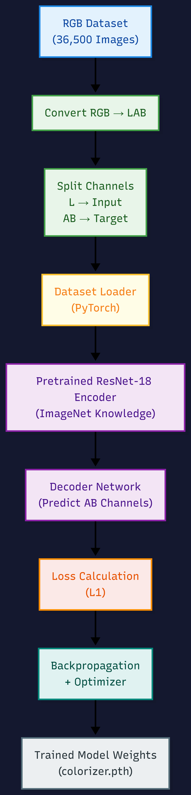
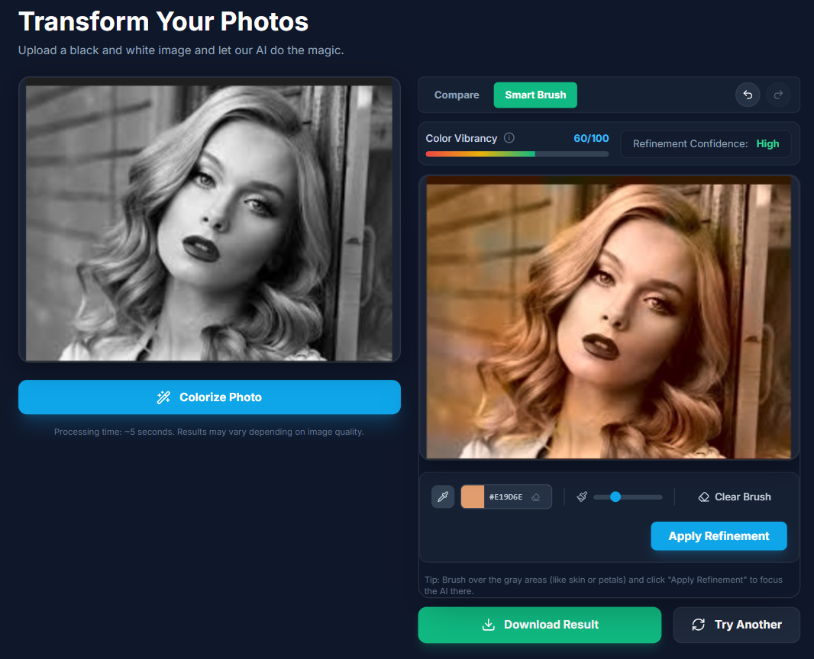
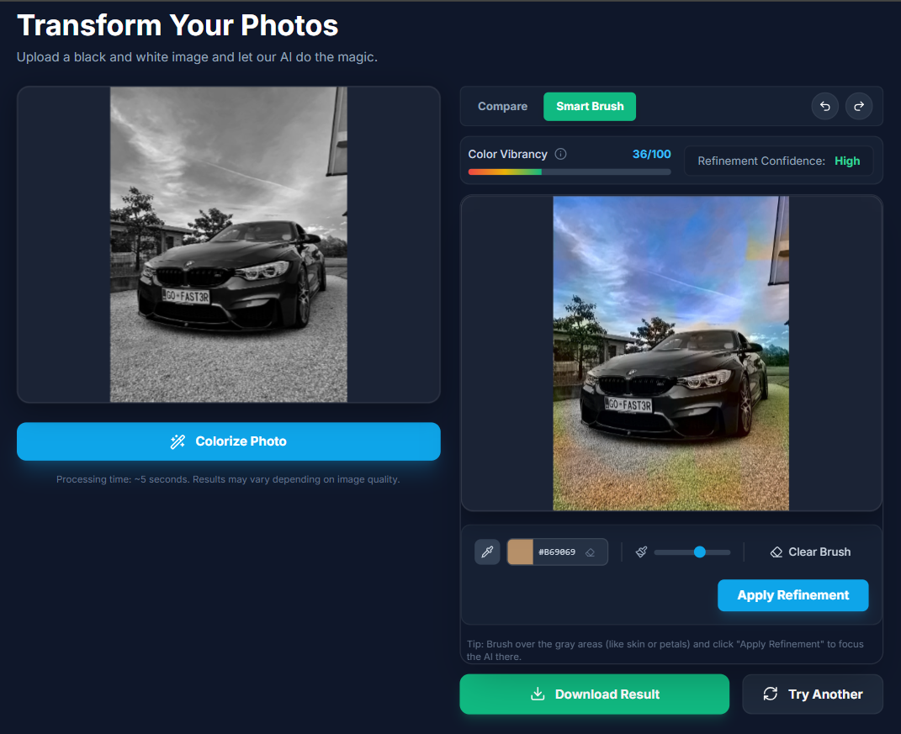

# 🎨 AI Image Colorization Web App

A deep learning–based system to colorize black-and-white images using computer vision and neural networks.
The project focuses on **faithful color restoration**, preserving image structure while intelligently predicting plausible colors.

---

## 🚀 Features

- 🧠 **Deep Learning Colorization**
  - Trained a neural network to map grayscale images to color (LAB color space).
  - Uses transfer learning with a pretrained encoder.

- 🖼️ **High-Resolution Inference**
  - Preserves original image details while applying AI-predicted colors.

- 🖌️ **Interactive Refinement (Smart Brush)**
  - Users can refine specific regions (e.g., faces, flowers) for better colorization.
  - Human-in-the-loop design improves results where visual cues exist.

- 🌐 **Web-Based Application**
  - Backend API built with FastAPI.
  - Frontend built with React for image upload and visualization.

- ⚡ **GPU Acceleration**
  - Supports CUDA-enabled GPUs for faster inference and training.

---

## 🧰 Tech Stack

### Backend
- Python
- PyTorch
- OpenCV
- FastAPI
- Uvicorn

### Frontend
- React
- Vite
- Tailwind CSS
- Framer Motion

### ML Concepts Used
- LAB color space
- Monotonic stacks (for preprocessing logic)
- Transfer learning
- CNN-based regression

---

## 📁 Project Structure

```bash
BW-colorization/
├── training/    # Model, dataset loader, training scripts
├── inference/   # Inference pipeline
├── webapp/
│   ├── backend/ # FastAPI backend
│   └── frontend/ # React frontend
├── model/       # Model directory (weights ignored)
├── data/        # Datasets (ignored)
├── output/      # Generated images (ignored)
├── results/     # Results (ignored)
├── requirements.txt
├── README.md
└── .gitignore
```

---     

## 🏗️ Model Weights
To run the application with the pre-trained model:
1. **Download the weights** from here: [**Download colorizer.pth**](https://drive.google.com/file/d/1eGip1reXxX8vZ32V2Gys1dRD-Jv67uwQ/view?usp=sharing)
   > **Note:** The model file is ~50MB and trained on a custom LAB colorization dataset for 20 epochs on GPU.
2. Place the `colorizer.pth` file in the `model/finetuned/` directory.
   - If the folder doesn't exist, create it: `mkdir -p model/finetuned`
3. The application will automatically load this model on startup.

## 🖼️ Sample Images for Testing
You can find sample black & white images to test the application here:
[**Download Sample B&W Images**](https://drive.google.com/drive/folders/1KoyXPuazAZK-taN4tUsh-Skg9Z0Gr6td?usp=drive_link)

---

## 🏗️ Training Process Flow


---

## ✨ Colorization Showcase
<p float="left">
  
   
</p>

## 🚀 Setup & Installations

### Backend Setup

```bash
python -m venv ai-env
# Windows
.\ai-env\Scripts\activate
# Linux/Mac
source ai-env/bin/activate

pip install -r requirements.txt
```

Run backend:

```bash
uvicorn webapp.backend.main:app --reload
```

### Frontend Setup

```bash
cd webapp/frontend
npm install
npm run dev
```

---

## 🧪 Notes on Colorization

The model performs best on:
- Human portraits
- Old photographs
- Nature scenes (trees, flowers, sky)

Some objects (e.g., apples, animals) are color-ambiguous in grayscale.
The system avoids hallucinating colors when visual cues are insufficient.
This is an intentional design choice for faithful restoration.

## 📊 Training Details

The model was trained with the following configuration:

- **Epochs**: 20
- **Best Validation Loss**: 8.1418
- **Dataset**: [Places365 on Kaggle](https://www.kaggle.com/datasets/pankajkumar2002/places365) (~3,000 processed pairs used).
- **Hardware**: Trained on a CUDA-enabled GPU.
- **Optimization**: Used Adam optimizer with mixed precision training (`torch.cuda.amp`).

- The model was trained using L1 reconstruction loss on the LAB color space, comparing predicted AB channels with ground-truth AB values.

- Both training and validation loss decreased steadily, indicating stable learning.

